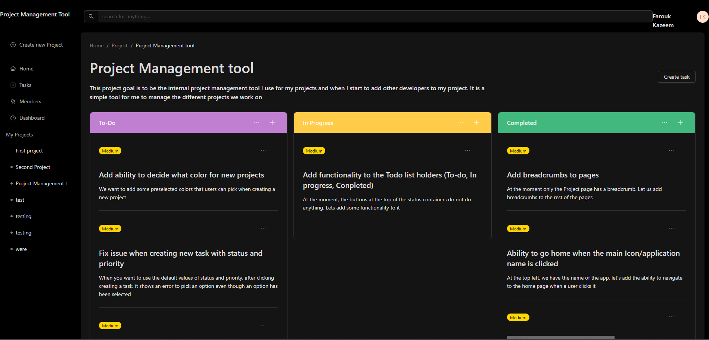

###  **Project Management Tool**

**Tech Stack**: Next.js, TypeScript, Ant Design, MongoDB, Apollo Client

**Roles**:

-   **Next.js**: Framework for building the app
-   **TypeScript**: Adds static typing
-   **Ant Design**: For UI components
-   **MongoDB**: Database for storing projects and tasks
-   **Apollo Client**: Handles GraphQL queries

**MVP Features**:

-   Task management
-   Project creation
-   User roles
-   Basic dashboard

**Time Management**:

-   **Week 1**: Task management
-   **Week 2**: Project creation
-   **Week 3**: User roles and permissions
-   **Week 4**: Dashboard and testing

https://dribbble.com/shots/24261482-TaskTrek-Project-Management-Tool

**Task Management**
- Create project
- Projects have 3 states
    -Todo
    -In progress
    -Done
- Each state can have different tasks
- Each state has a 3 priority (low medium and high)
- Create a new task
- ability to move task fron each state
    - a simple option tray should suffice (option to drag and drop later)
    - new task as a default state of todo

**Bankend Design**

- Build apollo server
- create mongodb instance
- create schemas

**App work flow for new users**

- User loads webapp
- user creates new projects
    - Definition of a new project (schema)
        - project name
        - project id (auto from mongodb)
        - project description
        - task array
        - users that have access to projects (coming soon)
        - date created
        - last updated
    - Definition of a new task (schema)
        - Task id (auto)
        - Task title
        - Task description
        - Task status
        - Task creation date
        - Task update date
        - Task priority
- adds new task to project
- changes task status from todo -> in progress -> done
- user can also edit project details
- user can also edit task details
- user can delete project
- user can delete task
- users can add multiple projects and tasks

**ISSUES WHILE DEVELOPING**

- Kept getting cant find findById in the client side code in useEffect. The cause of the issue was me trying to access server side code in the client side. I should have instead created an endpoint on the server to perform the action i want to perform like getting the information on the project or task i need.

- how to set up apollo client: https://medium.com/@sehrawy/how-to-set-up-nextjs-14-with-apollo-client-754a177e0a00

*22/07/24*

- Element implicitly has an 'any' type because expression of type 'string' can't be used to index type '{ PENDING: string; IN_PROGRESS: string; COMPLETED: string; ARCHIVED: string; }'.
  No index signature with a parameter of type 'string' was found on type '{ PENDING: string; IN_PROGRESS: string; COMPLETED: string; ARCHIVED: string; }' SOLUTION: use type assertion e.g const status: keyof typeof TODO_STATUS 

**TO DO**

*22/07/24*

- Fetch todo for each project - done
- Sort and display them accordiong to Todo, inprogress, completed - done
- Add necessary seveity tag - done

*23/07/24*

- Add functionality to tasks - done
- Add ability to move tasks to different status - done
- Add ability to delete tasks - done

*10/09/24*

- Add breadcrumbs to pages - done
- Ability to go home when the main Icon/application name is clicked - done
- Add description to Project page - done

*Update*

I have started using the application to track tasks for projects. I started using it to track it self. Overall barebone application functions as intended. Now need to advanced it bit by bit till we have something stable anyone or friends can use.

*11/09/24*

- Add functionality to the Todo list holders (To-do, In progress, Completed) - done
- Fix issue when creating new task with status and priority - done

